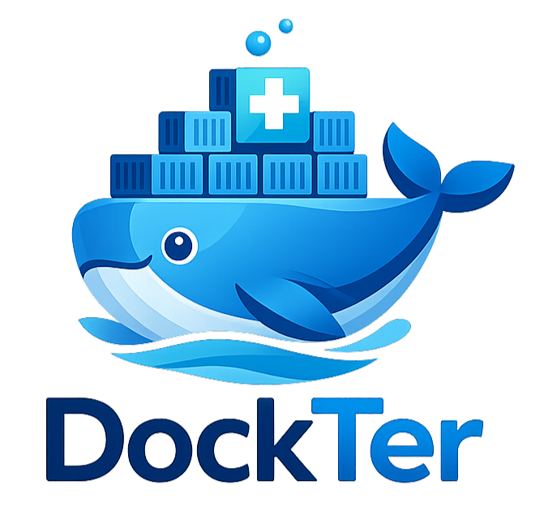
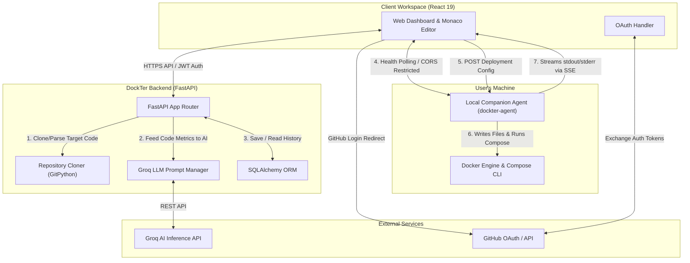

<p align="center">
  
</p>

<h1 align="center">DockTer</h1>

<p align="center">
  <strong>Intelligent Docker Configuration Generator & Local Container Orchestrator</strong>
</p>

<p align="center">
  <a href="https://github.com/ShrijalDubey/DockTer/blob/main/LICENSE">
    
  </a>
  
  
  
  
</p>

<p align="center">
  <a href="https://project-dockter.vercel.app">Live Demo</a> · <a href="#-getting-started">Getting Started</a> · <a href="#-cli-companion-agent">CLI Agent</a> · <a href="#-api-reference">API Reference</a> · <a href="#-system-architecture">System Architecture</a>
</p>

---

## 📖 Table of Contents
1. [Overview & Value Proposition](#-overview--value-proposition)
2. [Key Features](#-key-features)
3. [Visual Showcase](#-visual-showcase)
4. [System Architecture](#-system-architecture)
5. [Getting Started](#-getting-started)
    - [Prerequisites](#prerequisites)
    - [Dev Environment Setup](#1-dev-environment-setup)
    - [Containerized Full Stack Deployment](#2-containerized-full-stack-deployment)
6. [CLI Companion Agent](#-cli-companion-agent)
    - [Installation](#installation)
    - [Security Architecture](#security-architecture)
7. [Environment Variables](#-environment-variables)
8. [API Reference](#-api-reference)
9. [Troubleshooting Guide](#-troubleshooting-guide)
10. [Contribution Guidelines](#-contribution-guidelines)
11. [License](#-license)

---

## 🚀 Overview & Value Proposition

Containerizing modern software stacks is notoriously error-prone, involving manual setup of Dockerfiles, port mappings, database dependencies, network definitions, CI/CD pipelines, and web servers (like Nginx). 

**DockTer** eliminates this complexity. It is an intelligent, full-stack application that scans your source code dependencies, builds secure, production-ready Docker configurations using state-of-the-art AI inference (via Groq LLM), and deploys the entire application stack to your local environment with a single click.

Simply paste a public **GitHub URL** or drag-and-drop a **ZIP archive** of your project, customize your container preferences in a live Monaco-based code editor, and press **Deploy Locally** to see your containers spin up in real-time.

---

## 🌟 Key Features

| Feature | Description | Technical Stack |
|:---|:---|:---|
| **🔍 Repository Analyzer** | Scans file directory structures, config files (`package.json`, `requirements.txt`, `Cargo.toml`), and auto-detects programming languages, runtime frameworks, and system-level databases. | Python, GitPython, Regex Analysis |
| **🤖 AI Generation** | Leverages high-performance Groq LLM inference to output modular Dockerfiles, optimized `docker-compose.yml` assets, secure multi-stage builds, `.dockerignore` files, and CI/CD pipelines. | Groq API, Custom Prompt Pipeline |
| **🖥️ Interactive Editor** | Visualizes generated code using a Monaco-powered split-panel IDE complete with directory navigation trees and live code syntax highlighting. | Monaco Editor, React |
| **🎛️ Parametric Customization** | Tweak generation rules dynamically (e.g. use slim vs. Alpine base images, lock exact language runtimes, inject development hot-reloading, or target orchestrators). | FastAPI, React Context |
| **⚡ 1-Click Local Deploy** | Instructs the local companion agent to automatically write generated assets to disk and run container configurations immediately. | FastAPI Companion, Docker Engine API |
| **🪵 Live SSE Logs Console** | Streams real-time stdout/stderr from active container builds directly to the dashboard, rendering live CLI progress logs. | Server-Sent Events (SSE), Subprocess Pipes |
| **🔑 Secure Auth & History** | Uses GitHub OAuth to authorize user profiles and persists historical generation projects to a localized relational database. | JWT, SQLite / PostgreSQL, SQLAlchemy |

---

## 📸 Visual Showcase

### Landing Portal
A sleek, modern presentation showcasing quick installation guidelines and interactive navigation cards for dashboard operations and CLI companion integration.


### Management Dashboard
The primary landing workstation where you paste repository links or upload packages. Authenticated profiles enjoy history navigation tabs.


### Result Console & Monaco Editor
A split-screen coding editor offering real-time configuration adjustments, instant package generation preview, and interactive deployment controls.


### CLI Agent Setup Guide
An interactive walkthrough providing copy-paste commands to install and start the background agent locally.


---

## 🏗️ System Architecture

DockTer splits responsibilities across the React client, FastAPI server, local companion agent daemon, and persistent database layer.



---

## ⚙️ Getting Started

### Prerequisites
Before running DockTer, ensure you have the following installed on your machine:
* **Node.js** >= 20.x
* **Python** >= 3.11.x
* **Docker** & **Docker Compose**
* A **Groq API Key** (Obtain one at the [Groq Console](https://console.groq.com))
* A **GitHub OAuth Application** (Configure inside your GitHub profile under Developer Settings)

### 1. Dev Environment Setup

First, clone the repository and enter the directory:
```bash
git clone https://github.com/ShrijalDubey/DockTer.git
cd DockTer
```

#### A. Backend Setup
1. Move to the `backend/` directory and configure a virtual environment:
   ```bash
   cd backend
   python -m venv venv
   
   # Unix/macOS
   source venv/bin/activate
   # Windows PowerShell
   .\venv\Scripts\Activate.ps1
   ```
2. Install dependency libraries:
   ```bash
   pip install -r requirements.txt
   ```
3. Establish your environment parameters by copying the template:
   Create a `.env` file containing:
   ```env
   GROQ_API_KEY=your_groq_api_key_here
   GITHUB_CLIENT_ID=your_github_client_id_here
   GITHUB_CLIENT_SECRET=your_github_client_secret_here
   FRONTEND_URL=http://localhost:5173
   DATABASE_URL=sqlite:///./dockter.db
   JWT_SECRET_KEY=generate_a_secure_random_key_here
   ```
4. Start the development server via Uvicorn:
   ```bash
   uvicorn app.main:app --reload --port 8000
   ```
   The API will initialize at `http://localhost:8000`. Swagger documentation is available at `http://localhost:8000/docs`.

#### B. Frontend Setup
1. Navigate to the `client/` directory:
   ```bash
   cd ../client
   ```
2. Install Node dependencies:
   ```bash
   npm install
   ```
3. Spin up the Vite dev server:
   ```bash
   npm run dev
   ```
   Open your browser and navigate to `http://localhost:5173`.

#### C. Local Companion Agent Setup
1. Enter the `agent/` folder:
   ```bash
   cd ../agent
   ```
2. Install the agent in development/editable mode:
   ```bash
   pip install -e .
   ```
3. Launch the daemon:
   ```bash
   dockter-agent start
   ```
   The agent will boot on local port `8001`.

---

### 2. Containerized Full Stack Deployment

To execute the entire DockTer platform (excluding the CLI agent which must run on your host loopback to access local Docker commands) in a single command, run Docker Compose from the root workspace directory:

```bash
docker compose up --build
```

This launches the following containers:
* **`client`** (Port `3000`): React production build served via Nginx.
* **`backend`** (Port `8000`): FastAPI application linked to the database.
* **`db`** (Internal PostgreSQL service): Replaces the SQLite file database for enterprise usage.

---

## 🔌 CLI Companion Agent

The companion agent (`dockter-agent`) serves as a bridge between the browser window and your local shell. It is a highly lightweight FastAPI-based tool that handles safe local file operations and Docker command execution.

### Installation

The companion agent can be run or installed through multiple methods depending on your Python package workflow:

```bash
# Option A: Run instantly without installation using UV (Fastest)
uvx --from dockter-agent dockter-agent start

# Option B: Run isolated using pipx (Recommended for global CLI tools)
pipx run dockter-agent start

# Option C: Direct installation via pip
pip install dockter-agent
dockter-agent start
```

### Security Architecture

Because the agent is exposed to the local network and system calls, it implements rigid safety restrictions to guarantee system isolation:
1. **Host-Level Loopback Binding**: The server binds to address `127.0.0.1`. It refuses connection interfaces originating outside of localhost, ensuring external machines on public/private networks cannot access agent routes.
2. **Locked-Down CORS Controls**: Access headers are strictly limited to `http://localhost:5173` and the official production website `https://dockter.dev`. All other cross-origin scripts are terminated by the browser security framework.
3. **Workspace Isolation Sandbox**: File writing commands are restricted to a designated sub-directory sandbox (`dockter-{project_name}`) created locally within the directory the agent was initiated in. It prevents absolute path traversal attacks (`../../`) from editing host operating system files.

---

## 📝 Environment Variables

The DockTer API relies on the following configurations. Define these in `backend/.env`.

| Environment Variable | Category | Description | Default / Example | Required |
|:---|:---|:---|:---|:---|
| `GROQ_API_KEY` | AI Model | Authentication token to access Groq API services. | `gsk_yOuRApIKeY...` | **Yes** |
| `GITHUB_CLIENT_ID` | OAuth | OAuth App ID to manage GitHub user login routines. | `Ov23cx...` | **Yes** |
| `GITHUB_CLIENT_SECRET`| OAuth | Secret validation key matching the Client ID. | `3a95...` | **Yes** |
| `FRONTEND_URL` | Security | Allowed origin header value for backend CORS rules. | `http://localhost:5173` | No |
| `DATABASE_URL` | Storage | SQLAlchemy database connection URI. Supports SQLite/PostgreSQL. | `sqlite:///./dockter.db` | No |
| `JWT_SECRET_KEY` | Security | Secret key string used for signing login tokens. | `some-long-random-string` | No |

---

## 📡 API Reference

Below is the routing index for the DockTer FastAPI server.

### Authentication Endpoints

#### `GET /api/auth/github/login`
Initiates the GitHub OAuth authorization workflow by redirecting the client browser.

#### `GET /api/auth/github/callback`
Processes the authorization code returned by GitHub, exchanges it for an access token, stores user profile info, and issues a DockTer JWT.

#### `GET /api/auth/me`
Retrieves authenticated user data.
* **Headers**: `Authorization: Bearer <JWT>`
* **Response `200 OK`**:
  ```json
  {
    "id": 1,
    "github_id": 123456,
    "username": "coder_dev",
    "avatar_url": "https://avatars.githubusercontent.com/u/123456"
  }
  ```

### Configuration & Code Generation Endpoints

#### `POST /api/analyze`
Clones public repositories or decompresses upload archives to perform dependency detection analysis.
* **Request Body (JSON)**:
  ```json
  {
    "repo_url": "https://github.com/example/react-app"
  }
  ```
  *(Or raw multi-part form data containing a `file` field for ZIP uploads)*
* **Response `200 OK`**:
  ```json
  {
    "project_id": "abc-123",
    "detected_languages": ["JavaScript", "HTML"],
    "detected_frameworks": ["React", "Vite"],
    "dependencies": {
      "dependencies": ["react", "react-dom"],
      "devDependencies": ["vite"]
    }
  }
  ```

#### `POST /api/generate/{project_id}`
Generates Docker configurations using AI model parameters matching user choices.
* **Request Body (JSON)**:
  ```json
  {
    "base_image_type": "slim",
    "enable_hot_reload": true,
    "pin_versions": true,
    "orchestration_target": "compose"
  }
  ```
* **Response `200 OK`**:
  ```json
  {
    "project_id": "abc-123",
    "files": [
      {
        "path": "Dockerfile",
        "content": "FROM node:20-slim\n..."
      },
      {
        "path": "docker-compose.yml",
        "content": "version: '3.8'\n..."
      }
    ]
  }
  ```

### User History Endpoints

#### `GET /api/projects`
Retrieves a list of saved projects associated with the authenticated user profile.
* **Headers**: `Authorization: Bearer <JWT>`

#### `DELETE /api/projects/{id}`
Deletes a saved project record from the persistent database.
* **Headers**: `Authorization: Bearer <JWT>`

---

## 🛠️ Troubleshooting Guide

| Issue | Root Cause | Resolution |
|:---|:---|:---|
| **CORS Block Error** (Web Dashboard fails to connect to Agent) | The companion agent was configured with incorrect origin headers, or is not running. | 1. Double check the agent console to ensure it's listening on `http://localhost:8001`. <br>2. Confirm the agent is started from a terminal running on the same machine. <br>3. Ensure no local browser extensions or VPN proxies are blocklisting localhost requests. |
| **Groq API Rate Limits / Exceptions** | The Groq API key is expired, incorrect, or has exceeded its free-tier throughput constraints. | 1. Verify your key in `backend/.env` is correct. <br>2. Test the API key directly with curl to confirm standard system responses. <br>3. Switch to an alternative Groq model key or wait for the token bucket to refresh. |
| **Local Deploy Fails on Agent** | Docker Desktop is not running, or the host user account lacks access privileges to the system Docker socket. | 1. Verify that Docker Desktop is active. <br>2. Run `docker ps` in your local terminal. If it fails, add your user account to the local `docker` group or run the command prompt as an Administrator. |
| **GitHub OAuth Redirects Fail** | The `GITHUB_CLIENT_ID` or `GITHUB_CLIENT_SECRET` variables are mismatched, or the redirect URI on GitHub developer console is configured incorrectly. | 1. Ensure the redirect URI in your GitHub App console is set to `http://localhost:8000/api/auth/github/callback`. <br>2. Synchronize OAuth values inside `backend/.env`. |

---

## 🤝 Contribution Guidelines

We welcome pull requests and feature proposals to enhance DockTer! To maintain project security and stability, please adhere to the following workflow:

1. **Bug Reports & Ideas**: Open a GitHub issue describing the issue or suggesting new features.
2. **Pull Requests**:
   * Fork the repository privately or create a local branch.
   * Verify code quality by running standard checks (e.g. `flake8` for python formatting).
   * Submit a PR targeting the `main` branch. 
   * *Note*: As specified in the custom [LICENSE](LICENSE), pull requests require final review and express manual approval from the repository owner before merge integration.

---

## 📄 License

This repository is distributed under a **Customized MIT License**. 
* **Permitted**: Creating private forks, submitting contributions/PRs, and personal modifications.
* **Prohibited**: Publishing, selling, or distributing public modifications/derivatives of this platform without express written permission from the copyright owner.

For details, see the complete [LICENSE](LICENSE) file.

---

<p align="center">
  Crafted with ❤️ by <a href="https://github.com/ShrijalDubey">Shrijal Dubey</a>
</p>
